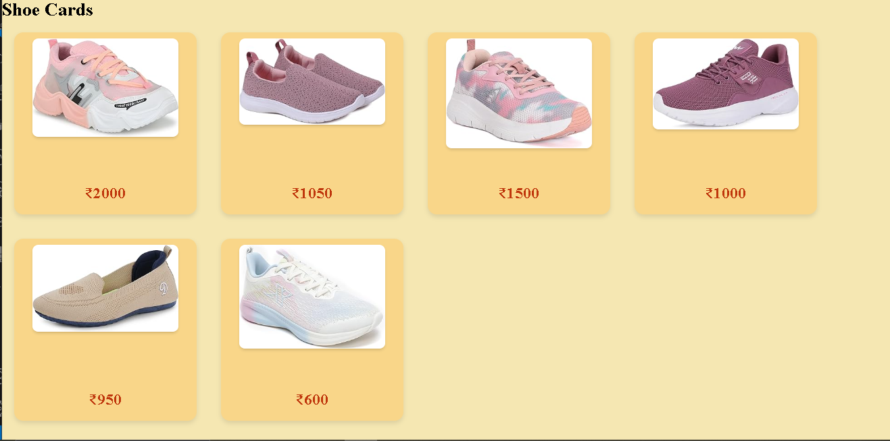
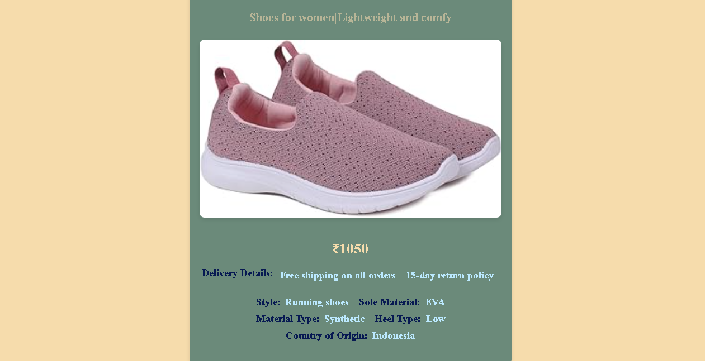

# ShoeDetailCard - Shoe Product Detail View App

Welcome to **ShoeDetailCard**, an engaging application that provides detailed views of various shoe products. This project is built using React.js and focuses on advanced routing concepts, such as dynamic routing, mapping, and parameter passing.

## Table of Contents

- [Description](#description)
- [Features](#features)
- [Usage](#usage)
- [Components](#components)
- [Data Structure](#data-structure)
- [Technologies Used](#technologies-used)
- [Future Enhancements](#future-enhancements)


## Description

ShoeDetailCard is a React.js application created to practice advanced routing concepts like dynamic routing. This app also covers key React concepts, including mapping, passing routing parameters, and using the `find` function and `substring` method.

In this project:
- Dynamic routing is implemented by creating views.
- Only the Home view is created as of now.
- All necessary libraries are imported.
- A static array of shoe data is created (in future projects, this data will be user-generated with backend support).

The project demonstrates how to display shoe product details in a card format by creating a reusable shoe detail component. It also showcases the use of destructuring in React components.

## Features

- Dynamic routing with React Router
- Display shoes in a card format
- Home view with a list of shoe cards
- Detailed shoe view using routing parameters
- Static data array for shoes

## Usage

Once the development server is running, you can access the app in your web browser at [http://localhost:3000](http://localhost:3000). The Home view will display a list of shoe cards. Clicking on a shoe card will navigate to a detailed view of the selected shoe using dynamic routing.

## Components

- **ShoeCard**: Displays individual shoe details in a card format.
- **Home**: Renders a list of shoe cards using the ShoeCard component.
- **ShoeDetail**: Displays detailed information about a selected shoe using routing parameters.
- **Navbar**: (Future enhancement) Navigation bar for the application.




## Data Structure

The shoe data is currently stored in an array of objects. Each object represents a shoe with the following structure:

```javascript
const ShoeData = [
  {
    id: "Air Max 2024",
    shoeImg: AirMax,
    title: "Nike Air Max 2024",
    description: "Experience unparalleled comfort and style with the latest Nike Air Max 2024...",
    price: "$150",
    brand: "Nike",
    releaseDate: "June 15, 2024",
  },
  // Additional shoe objects...
];
```

## Technologies Used
- React.js
- React Router
- JavaScript (ES6+)
- CSS

## Future Enhancements

- Add backend support for user-generated shoe content
- Implement authentication and user profiles
- Create additional views (e.g., About, Contact)
- Enhance the Navbar component for better navigation
- Improve styling and responsiveness
